# PetFinder.my Adoption Prediction
## Introduction

This blog post introduces our team’s solution to the Neural Networks (LTAT.02.001) project, which is based on the Kaggle competition [“PetFinder.my Adoption Prediction”](https://www.kaggle.com/c/petfinder-adoption-prediction). The project’s goal is to predict how fast the pet is adopted (if adopted at all), using the data from the Malaysian animal welfare platform PetFinder.my. The dataset includes the general data (the pet’s size, color, breed, name, etc), the images, image metadata (supplementary information for the images from Google’s Vision API analysis), and the sentiment analysis (from Google’s Natural Language API analysis for pet descriptions). The required output for the model is a categorical label from 0-4. The submissions for the contest are graded by making use of quadratic weighted kappa, which measures agreement between two raters - 0 if there is no agreement at all and 1 if there is complete agreement between raters.

## Data Overview and Exploration
The first step is to try and understand the data we are working with. For this we consult the documentation provided at the competition’s website. We provide descriptions for each of the features and try to describe them by making use of visualizations. By doing this we hope to get some ideas on more informative features within the dataset.

PetFinder.my provides 14,993 samples for training, where each sample has 24 features + n images (depict a dog or a cat) + metadata + sentiment info. There are a total of 58,311 images per training set, where some images (see Image 1) illustrate multiple animals.


Image 1. Example of the case, where one image file has multiple images of the animal.

Provided by the competition holder are following files: 
- _train.csv_ - consists of training data, this is the set of data with target labels, which we can use to train our models on;
- _test.csv_ - consists of test data, without target label, this will be used for Kaggle submission;
- Image metadata files - set of json files, with output of image analysis provided by the contest holder; 
- Sentiment data files - set of json files, with output of sentiment analysis on _Description_ field.


Additionally there are files to map integer values within _train.csv_ which represent categories to strings: _breed_labels.csv_ (BreedId to a name of the breed), _color_labels.csv_ (color id to a color), _state_labels.csv_ (state id to a state). 


In _train.csv_ the following features are included: 
- PetID - ID representing a pet, this can be used to map sentiment analysis results and pet images to a specific pet;
- AdoptionSpeed - This is the target label used for training and prediction, it takes an integer value between 0 to 4. **0** means the pet was adopted on the day of it being listed within their system, **1** means that the pet was adopted between within 1-7 days,**2** within 8-30 days, **3** within 31-90 days. **4** means that the pet was not adopted after 100 days of being listed;
- Type - represents type of a pet, where 1 stands for Dog and 2 for Cat;
- Name - represents name of a pet;
- Age - pet’s age in months;
- Breed1 - primary breed;
- Breed2 - secondary breed, this is missing if pet is a purebred;
- Gender - pet’s gender, where 1 is Male, 2 is Female and 3 is Mixed (because listing can include several pets);
- Color1-3 - Colors of pets;
- MaturitySize - pet’s size, where 0 means is unspecified, 1 stands for a small pet, 2 for medium, 3 for large and 4 for extra large;
- FurLength - pet’s fur length, 0 is not specified, 1 is short, 2 is medium and 3 is long;
- Vaccinated - pet’s vaccination status, 1 means vaccinated, 2 unvaccinated and 3 means unsure;
- Dewormed - pet’s deworm status, 1 means dewormed, 2 not dewormed and 3 unsure;
- Sterilized - pet’s sterilization status, where 1 means spayed / neutered, 2 not spayed / neutered  and 3 unsure;
- Health - pet’s health condition, where 1 is healthy, 2 minor injuries,  3 serious injuries and 4 not specified;
- Quantity - count of pets within the listing;
- Fee - pet’s adoption fee, where 0 is free;
- State - state within country of Malaysia;
- RescuerID - rescuer’s ID;
- VideoAmt - count of videos within listing;
- PhotoAmt - count of photos within listing;
- Description - free-form text for describing the pet / listing.


Given by the contest holder is output data from sentiment analysis performed using Google's Natural Language API on field _Description_, and in the file there is a score and a magnitude for every sentence. Score is within a range of -1 to 1, with positive score indicating the positive nature of a sentence and negative indicating the opposite. The magnitude shows how strong the given sentiment is. Also provided is a summarized magnitude and score for the full text. Those are within zipped files _train_sentiment.zip_ and _test_sentiment.zip_.


For images, the contest provides output data from running all the images through Google's Vision API, which provides Face Annotation, Label Annotation, Text Annotation and Image Properties, giving information on for example where pets are located on pictures and what do they seem to look like. Those are within zipped files _train_images.zip_ and _test_images.zip_.


### Checking for missing values
From the features within _train.csv_, we found that there were 1257 missing values for _Name_ and 12 missing values for _Description_.

### Investigating feature distributions
To better know what’s going on in the data, we performed visualized the distributions of features. We plot the distribution of the features individually and then also look at the distributions by _AdoptionSpeed_ (target). On Figure 2 is plotted the target variable _AdoptionSpeed_.  We first note, that the class of pets adopted within the day of listing is considerably smaller (under 500) compared to every other class (over 3000 to 4200). 

<p float="left">
  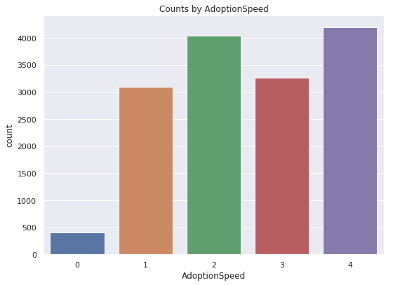 
</p>

Figure 2. Distribution of target variable AdoptionSpeed.

<p float="left">
  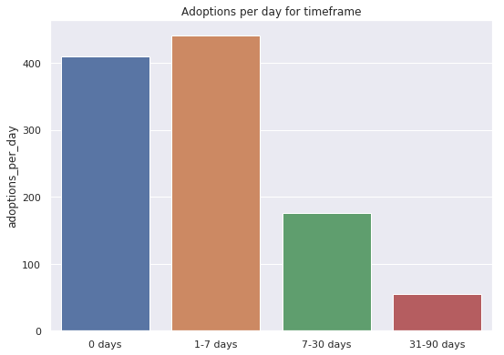 
</p>

Figure 3. Average number of pets adopted per day within timeframe.

Plotted on Figure 3 is the number of pets adopted per day timeframes. By dividing the number of pets with the size of timeframe (number of days), we can find how many pets were adopted on average on each day. We note that most adoptions happen during the first week of the listing. As time goes on, the number of adoptions per day gets lower.


<p float="left">
  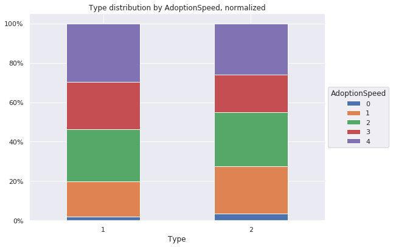 
  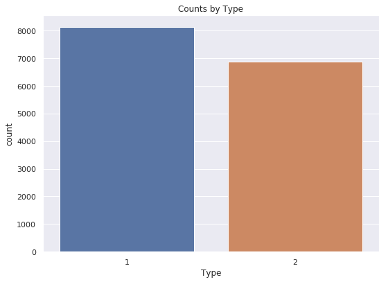
</p>
Figure 4. Distributions of AdoptionSpeeds for dogs and cats separately and Figure 5. Counts of dogs (1) and cats (2) within the training dataset.


Plotted on Figure 4 are normalized distributions of the target label counts for dogs (1) and cats (2), where we can see that cats are more likely to be adopted and are adopted earlier. Plotted on Figure 5  is the number of dogs and cats, we can see that the counts of dogs and cats are pretty close, with there being some more dogs than cats. 

<p float="left">
  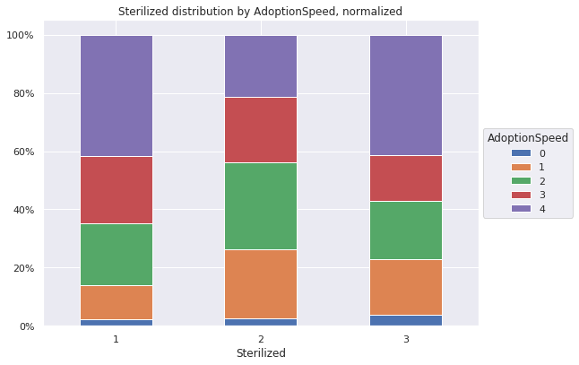
  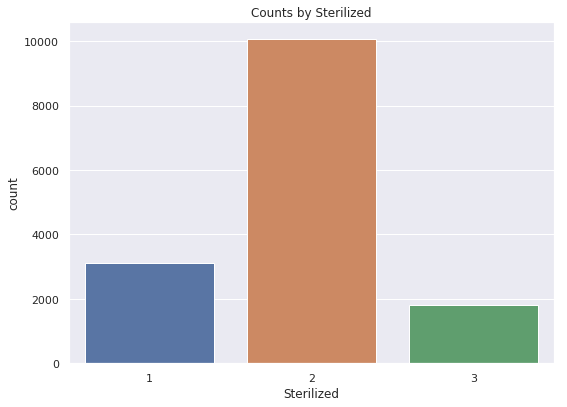 
</p>

Figure 6. Distributions of AdoptionSpeeds and counts of Sterilization status. 1 is spayed / neutered, 2 is not spayed/neutered and 3 means unsure. 

We can see, that most of the pets are listed as not sterilized, which can be due to costs and additional work needed to be done. From data, oddly enough, it seems that the the non-spayed pets have higher adoption rate compared to sterilized ones.


<p float="left">
  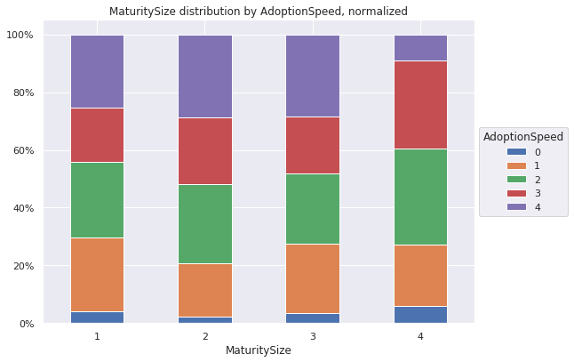
  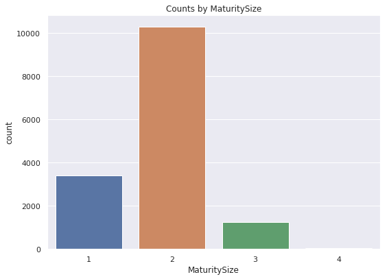 
</p>

Figure 7. Feature MaturitySize: 1 - small, 2 - medium, 3 - large, 4 - extra large

On Figure 7 is plotted the distributions for MaturitySize. We note that most of the pets are medium size and and almost none are extra large. From the distributions, we can note that people prefer to adopt either small or extra large pets, with medium and large being more neglected.

<p float="left">
  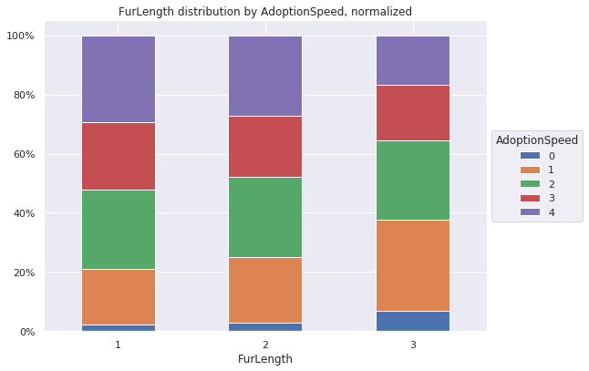
  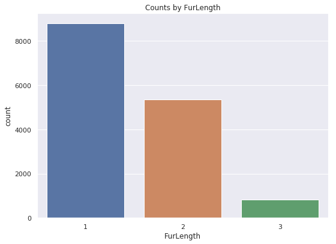 
</p>


Figure 8. Feature FurLength: 1 - short, 2 - medium, 3 - long, 4 - not specified. 

On Figure 8 is plotted the distributions for feature FurLength. We note that most pets have short fur and least with long fur. From the distributions of AdoptionSpeed we note that people prefer pets with long fur. Medium fur pets are slightly more adopted compared to short fur. There were no pets with unspecified fur length within the data set.  

<p float="left">
  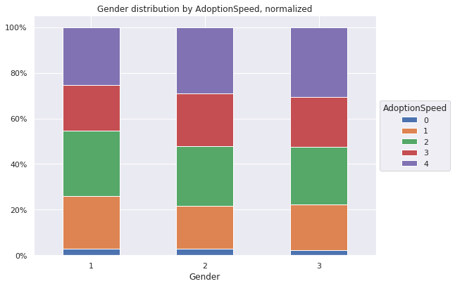
  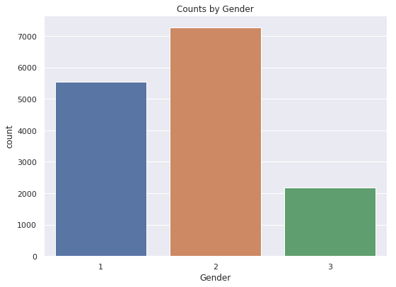 
</p>

Figure 9. Feature Gender: 1- Male, 2 - Female, 3 - Mixed

Figure 9 plots the distribution of gender (right) and adoption speed distributions per gender (left). In the training data, there are more female than male dogs. Looking at the distribution of adoption speeds we can see that male pets are slightly more preferred to female pets.

<p float="left">
  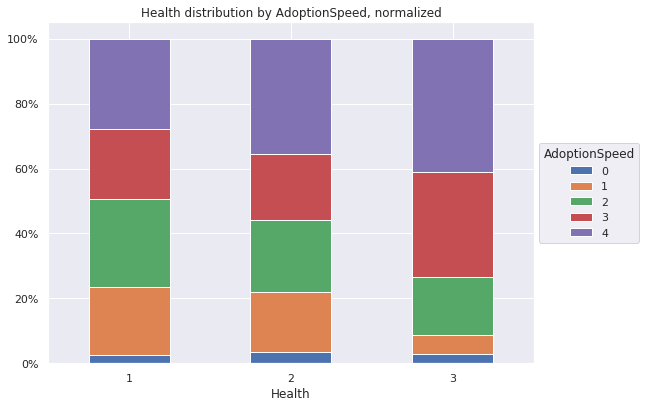
  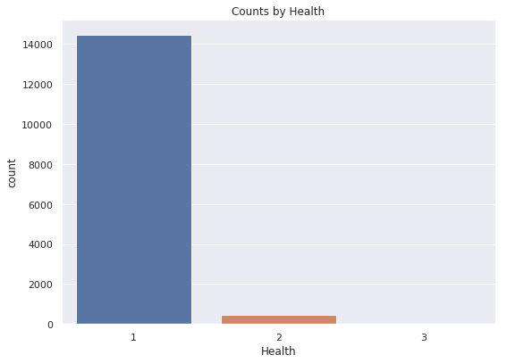 
</p>
Figure 10. Feature Health: 1 - Healthy, 2 - minor injuries, 3 - major injuries.

Figure 10 plots the distribution of health status (right) and adoption speed distributions per health status (left). We note that most of the pets in the data set are healthy (1), with few having minor injuries (2) and only small with major injuries. We can note, that injured pets are less likely to be adopted.

<p float="left">
  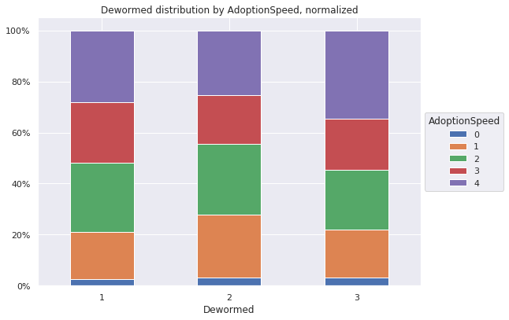
  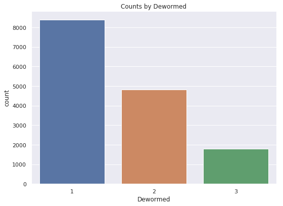 
</p>
Figure 11. Feature dewormed: 1 - dewormed, 2 - not dewormed, 3 - not specified

Figure 11 plots the distribution of pet being dewormed (right) and adoption speed distributions for each dewormed status. Most of the pets are dewormed (1), but there is also plenty which are either not dewormed (2) or not specified (3). In here we note that pets without specific status are less likely to be adopted. 

<p float="left">
  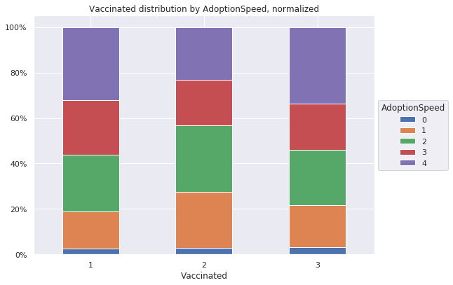
  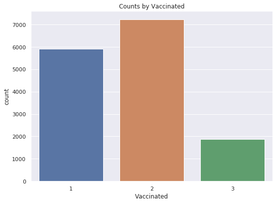 
</p>
Figure 12. Feature vaccinated: 1 - vaccinated, 2 - unvaccinated, 3 - not specified

Figure 12 plots the distribution of pet being vaccinated (right), unvaccinated or not specified. Oddly enough, we note that people are more likely to adopt unvaccinated pets

<p float="left">
  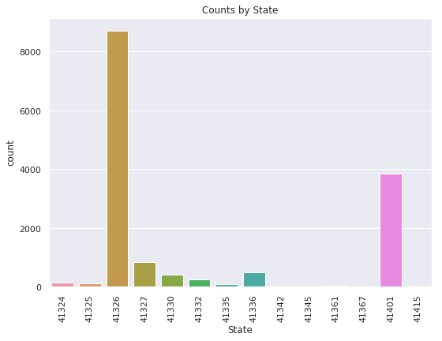
</p>
Figure 13. Feature state.

On Figure 13 we can see that most of the listings are done in one of two different states. 

<p float="left">
  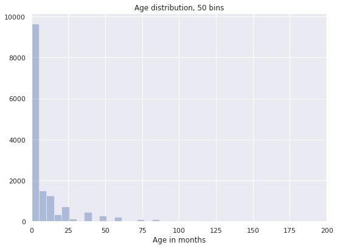
</p>
Figure 14. Feature Age.

Looking at the age distribution plotted on Figure 14, we can see, that most of the pets are really young (0-5 months).

<p float="left">
  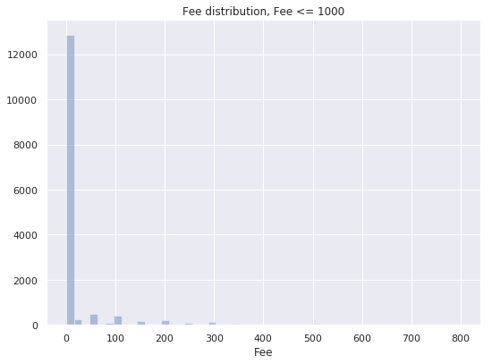
</p>
Figure 15. Feature Fee.

On Figure 15 we can see that most of the pets are do not have any fee.

Looking at the average fee for each class, we can see that there is not much of a difference:

AdpSpeed | 0 | 1 | 2 | 3 | 4 
-----|-----|-----|-----|-----|----- 
Avg Fee |22.086|21.822|21.582|20.151|21.315 

## Baseline modeling
To evaluate how useful our neural networks are, we compared them to some baseline models, namely the **Random Forest classifier** (RFC) and **Gaussian Naïve Bayes** (GNB). RFC was selected because of its speed and good performance in many machine learning tasks, while GNB is a good probabilistic baseline for...  RFC performed the best on the raw … data and thus, was selected as the baseline method for further tests. 

The sklearn implementations of both methods were used in this project. We tested various values of the _n_estimators_ and _max_depth_ parameters, the first specifying the number of trees in the forest and the second setting the maximum depth of a tree in the forest. According to the test cohen-kappa score, accuracy and cross-validation accuracy we found the best _n_estimators_ to be 60 and _max_depth_ 15. These are kept constant through the rest of the project. 

In addition, we ran the data through the **SelectKBest** method before applying RFC, testing if feature selection would significantly improve the scores on … data so that we could eliminate some redundant features immediately. In the end, testing different _k_ values and scoring functions did not give notable differences in the results and thus only the RFC model was kept from the pipeline.

## Feature engineering
From our initial tests it quickly became clear that only using some basic techniques like normalization and one-hot-encoding would not give us good results. Therefore, we implemented various feature engineering methods to extract more useful information from the given data.

### TF-IDF
TF-IDF is a metric to evaluate the significance of a word in some document which belongs to a group of documents. TF-IDF considers both the frequency of the word in the particular document (TF, term frequency) and the inverse document frequency (IDF) which decreases the importance of words that frequently appear in all documents (e.g very common words, like articles). 

The intention is to use this metric to determine the most important words in the pet descriptions for every adoption speed category. If there even exists a small set of words that represent a specific category, it could provide useful information to help differentiate the samples of different categories.

There are different variants of the formula, the ones used in this project are the following:
….
https://nlp.stanford.edu/IR-book/html/htmledition/maximum-tf-normalization-1.html https://skymind.ai/wiki/bagofwords-tf-idf

The normalized variant of the TF formula was used with K = 0.5. 
In this case, a document comprised all of the descriptions in the given category (adoption speed) and thus there were altogether 5 documents. The TF-IDF score was calculated for every word in a document to determine the words that best describe each adoption speed. To ease the process, different preprocessing methods were applied to the texts, including lemmatization and name extraction (i.e. eliminating names from texts). 

The 10 best features were selected from every category and used as features. The feature values were calculated as the number of times the word appeared in the given description. 

### Encoding Methods
There are many well-known methods for feature engineering which involve encoding the features in some specific way. The four methods that were used in this project are **mean encoding, count encoding, binning numerical data** and one-hot-encoding. Different combinations of features were tested with the encoding methods. 

**Mean or target encoding** involves encoding a categorical value with its ratio to the target [variable](https://www.slideshare.net/HJvanVeen/feature-engineering-72376750). That is, in a binary classification task every categorical value _x_ in a feature _f_ is replaced with the percentage of samples in which the target class is 1 and the f value is _x_ among all the samples where _f = x_. As there are _5_ classes instead of _2_ in this particular task, then if mean encoding is applied to feature _f_, the columns _f_AdoptionSpeed0, f_AdoptionSpeed1, … , f_AdoptionSpeed4_ are generated, each containing the encoding of a feature for the particular value of the category. 

**Count encoding** a feature involves replacing every feature value with its count. 

Numerical data can either be normalized or **binned** to some intervals, which helps eliminate useless noise and could reveal important tendencies that were hidden due to the noise. 

### Other Features
Several new features were generated from the raw data to extract information that could be important to the classifier. These features are listed below.
1. **The number of colors**. For each pet we calculate the number of colors in their fur. 
2. **The number of breeds**. The number of breeds are calculated for every pet.
3. **Is the given state popular**. There were two Malaysian states in the dataset (namely ...) where most of the pets were adopted from. This feature is boolean, the value True indicating that the sample’s state is either of the two popular states and False indicating otherwise.

## Network architectures
### [Images CNN](https://github.com/PriitPaluoja/PetFinderNN/blob/master/ImagesCNN.ipynb)
Images CNN uses transfer learning. Pre-trained [Xception](https://arxiv.org/abs/1610.02357) model is used with  ImageNet weights. All layers except last 3 layers of the Xception  model are frozen during training. Auxiliary input from training.csv and sentiments is given and sent through 4 hidden layers and merged (merged layer) with the output of the Xception.

The following features are given from auxiliary input:
- “Type”
- “Gender”
- “Color1”
- “Color2”
- “Color3”
- “MaturitySize”
- “FurLength” 
- “Vaccinated”
- “Dewormed”
- “Sterilized”
- “Health”
- “State”
- “MaturitySize”
- “Age”
- “Fee”
- “Quantity”
- “PhotoAmt”
- “Magnitude”
- “Score”

From these features, the following are standardized: “Age”, “Fee”, “Quantity”, “PhotoAmt”. 

The inputs for Xception, the images, were  rescaled to 100 x 100 and standardized.

The merged layer is further followed by two hidden layers. Final hidden layer of size five uses softmax activation, while all the other hidden layers use ReLU. This model is configured to use categorical cross entropy loss, learning rate of 0.001 with Adam optimizer. Model is set to train 4 epoch and save the best model only.


Figure. ImageCNN architecture

**ImageCNN code**

```python
transfer = Xception(weights='imagenet', include_top=False, input_shape=(height, width, 3))

# Freeze Xception
for layer in transfer.layers[:-3]:
    layer.trainable = False

# Inputs
image_input = Input(shape=(height, width, 3))
aux_input = Input(shape=(len(list(X_train_else)),))

# Images:
transfer = transfer(image_input)
flatten = Flatten()(transfer)

# Aux input:
x = Dense(250, activation='relu')(aux_input)
x = Dense(350, activation='relu')(x)
x = Dense(450, activation='relu')(x)
x = Dense(700, activation='relu')(x)

# Merged:
merge = concatenate([flatten, x])
x = Dense(100, activation='relu')(merge)
h = Dense(5, activation='relu')(x)

# Predictions:
predictions = Activation('softmax')(h)

model = Model(inputs=[image_input, aux_input], outputs=predictions)
model.compile(optimizer=Adam(lr=0.001), loss='categorical_crossentropy', metrics=['accuracy'])


history = model.fit([X_train_img, X_train_else], 
                    keras.utils.to_categorical(y_train),
                    batch_size=BATCH_SIZE, 
                    epochs=4, 
                    validation_split=0.1,
                    callbacks=[ModelCheckpoint('test_model.h5', save_best_only=True)])

```

### [Images CNN + Pre-Trained Word Embeddings](https://github.com/PriitPaluoja/PetFinderNN/blob/master/ImagesCNNEmbedVect.ipynb)
We also tried adding more features. For that we downloaded [fastText](https://fasttext.cc/docs/en/english-vectors.html) pre-trained word embeddings. More precisely, we used their (T. Mikolov, E. Grave, P. Bojanowski, C. Puhrsch, A. Joulin. Advances in Pre-Training Distributed Word Representations) 1 million word vectors trained on Wikipedia 2017, UMBC web based corpus and statmt.org news dataset.
Next, for each sentence in sentiments data file per animal, we mapped word to pre-trained word vector and summed the vectors over sentence and added these features (each word vector was 300 units long) to the initial auxiliary input. This resulted 
extra features per animal. 

### Only Images
Several network architectures were tested with only image data, using convolutional, dropout and fully connected layers. Different learning rates and optimizers were tested and the images were  rescaled to 100 x 100 and standardized. 
 
### Images CNN + TF-IDF
After giving promising results, the Images CNN network was also used with the TF-IDF data. The three last layers of the Xception model were left unfrozen and 3-5 additional fully connected layers were tested. 

### Images CNN + Encoding Methods
The network was also tested with various datasets that were generated using encoding methods on different sets of variables. Three last layers of the Xception model were left trainable while 4-5 additional fully connected layers were added. 

## Evaluation
[Kaggle](https://www.kaggle.com/c/petfinder-adoption-prediction/overview/evaluation) scores submissions based on the quadratic weighted kappa, which measures the agreement between two ratings.
From [Kaggle](https://www.kaggle.com/c/petfinder-adoption-prediction/overview/evaluation): if metric is near 0, it indicates that there is random agreement between raters and if near to 1, there is a complete agreement between rates. Even more, if there is  is less agreement between the raters than expected by chance, the metric can be negative.

### Images CNN 
Images CNN was trained for four epochs with train size of 0.8. This resulted in quadratic weighted kappa of 0.295 on training and 0.239 on test set. Accuracy was correspondingly 0.386 and 0.352. Testing it on Kaggle resulted in quadratic weighted kappa of 0.230.
Although this score was achieved with four runs, we have tested it on more than four epochs, but in overall this resulted in overfitting and kappa score under 0.2 on Kaggle.


Figure. Images CNN training time loss and accuracy change.It can be seen that on the fourth epoch (third, if counting from 0), loss starts to increase on validation set.

### Images CNN + Pre-Trained Word Embeddings
Images CNN with pre-trained word embeddings was trained for 10 + 4 epochs. Kappa on training data was 0.485 and on test 0.203. Accuracy was 0.531 and 0.348 on training and test data. Kaggle evaluation returned us the kappa score of 0.159. It is interesting that adding more features returned 69% lower kappa than Images CNN without pre-trained word embeddings. 

Maybe if one would remove used stop words use other natural language processing techniques such as removal of frequent words, it could enhance the results. In our case it seems that summing sentences word vectors leads to a overfitting.


Figure. Images CNN + pre-trained word embeddings loss and accuracy during different epochs. It can be seen that while on training data loss is decreasing and accuracy increasing, on the validation set, everything is the opposite. This is a sign of overfitting.

### Random Forest classifier (RFC) 
With number of estimators being 70, random forest return kappa score of 0.33 on test set and accuracy of 0.99 and 0.40 on training and test set. With number of estimators being 65 and max depth of 15, Kaggle kappa score was 0.214. 
We also tried random forest hyperparameters found from [public Kaggle kernel](https://www.kaggle.com/dan3dewey/baseline-random-forest-with-get-class-bounds). These were: 
- Bootstrap
- Gini 
- Max depth of 80
- Auto max features
- Min samples for leaf: 5
- Min samples for split: 5
- Number of estimators: 200

This resulted in Kaggle kappa of 0.240.

### Images CNN + TF-IDF
...
The following image depicts word clouds for the description of the five adoption speed classes. 


We can see that the most prevalent words in all categories are similar, common words describing the pets. However, there is one word that particularly stands out for one particular category, namely ‘home’ for speed 0, and does not appear as important for others. TF-IDF analysis tried to find similar important words.

We tried two versions of TF-IDF: with only words (1-grams) and with (1-3)-grams. Three models were tested with 1-grams: with 3, 4 or 5 additional fully-connected layers to the Xception model. From the results it was clear that using a smaller amount of layers yielded a better score: with 5 layers, the Kaggle test score was 0.14, while higher than 0.19 with the others. The loss and accuracy of the best model (score 0.199) over the training epochs is shown on the figure below. 


This plot shows that the validation results even exceeded those of the training results several times.

### Only Images
We tested 8 different models with different structures: 1-3 fully connected layers, 2-4 convolutional layers, dropout with rate 0.5 or no dropout, with learning rate equal to 0.1, 0.01 or 0.001 and the Adam or RMSProp optimizer. As these architectures resulted in very poor cohen-kappa scores for both train and test (below 0.1), these models will not be elaborated on further.

### Images CNN + Encoding Methods
We tested various combinations of parameters and methods. Different feature sets were chosen for different encoding techniques.
The total set of features used for binning are: Age, Quantity, Fee, VideoAmt, PhotoAmt, RescuerID**
The total set of features used for mean encoding are: Age*, Quantity*, Fee*, VideoAmt*, PhotoAmt*, MaturitySize, FurLength, Gender, Color1, Color2, Color3.
Additional features were taken from the following: NrColors, NrBreeds, IsPopularState, document magnitudes, document sentiment.
For count encoding we tried the RescuerID feature. 

\* _Mean encoding was applied only after binning the data._

\*\* _Binning was applied only after applying count encoding._

We tested mean encoding in two ways. In the first case, the ratios were calculated using all samples, while for the second case the ratios were calculated for the two types - cats and dogs - separately. While we did not manage to do a fully systematic analysis, the results we had could indicate that using the differentiating kind of mean encoding improves the results (in our example by 0.06 score points). 

For the bins, we manually set the values, based on the distribution of the features and the intuitive understandings of what certain divisions might imply. For example, as the amount of videos ranged from 0 to 8, we thought it best to categorize VideoAmt as 0 or 1-8, as one video is often informative enough to a potential adopter. In contrast, for Age one option of bins was defined by [-1, 4, 10, 18, 36, 255], where the numbers denote the edges of bin ranges. This should cover the basic stages of a pet’s age. 

Due to limited time, we were not able to test a lot of values for all binned features and thus we are not able to make concrete deductions on the sizes of bins for different variables. 

Count encoding was only applied to one feature, RescuerID, which was then also binned. However, from looking at the feature importances determined by the Random Forest model, this feature seemed to not contribute much to the result and was thus left aside. 

Most of the datasets were tested with the basic Images CNN model, with a few exceptions that used one additional fully connected layer. All models were able to score above 0.13 with the Kaggle test set, while Random Forest with the same data always scored higher than 0.2. 

The best NN model resulted in a Kaggle test kappa score of 0.169. This model used NrColors, NrBreeds, IsPopularState as extra features, all of the possible features for mean encoding, without any count encoding features. The following figure shows the loss and accuracy of the model.


From the loss-accuracy plot of the model we can see that the accuracy peaked at the second epoch and started to decline from there.

These encoding techniques provide countless possibilities to generate datasets and extract information. Thus, it needs a more systematic and in-depth analysis than we were able to conduct in the time given. 

## Conclusions


